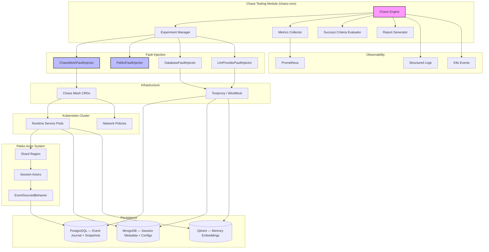

# Design Document: Chaos Engineering Testing

## Overview

This design introduces chaos engineering capabilities to the agent-engine platform, enabling
controlled fault injection to validate resilience, error handling, and recovery mechanisms across
the distributed Java 25/Quarkus runtime.

The chaos testing system has two tiers:

1. **Infrastructure fault injection**: Delegated to [Chaos Mesh](https://chaos-mesh.org/) (CNCF
   project), which provides Kubernetes-native CRDs for pod kills, network faults, and resource
   stress. The Chaos_Engine manages these by creating and deleting Chaos Mesh custom resources
   via the Fabric8 Kubernetes client.
2. **Application-level fault injection and validation**: Custom Java code for actor message
   interception (Pekko `BehaviorInterceptor`), database connection simulation (Toxiproxy), and
   session/event-journal consistency checks.

This split means the custom Java implementation focuses only on the agent-engine-specific
behaviour that generic chaos tooling cannot cover.

### Why Chaos Mesh Instead of DIY Infrastructure Injection

Building custom sidecar injection for network faults, `tc` rules for latency, and stress-ng
container management is significant engineering work that Chaos Mesh already provides as a
battle-tested platform. Adopting Chaos Mesh reduces the chaos module's implementation scope by
~60% and lets engineers focus on the application-level validations that are actually specific to
agent-engine.

### Why Toxiproxy for Database Faults

Kubernetes network policies block at the IP level, giving binary on/off control. Toxiproxy
proxies at the TCP connection level, enabling richer simulation: connection resets, slow
responses, partial writes, and bandwidth throttling — precisely the conditions that expose
connection pool and retry logic bugs.

## Architecture

### Component Diagram



### Module Structure

The chaos testing feature is implemented as new modules following the existing architecture
pattern. Register both in `settings.gradle`:

```
include 'chaos:api'
include 'chaos:core'
include 'chaos'
```

Directory layout:

```
chaos/
├── api/                              # Public API contracts (no implementation deps)
│   ├── ExperimentDefinition          # Experiment configuration model
│   ├── ExperimentResult              # Execution results and metrics
│   ├── FaultType                     # Enumeration of fault types
│   ├── FaultParameters               # Sealed interface hierarchy for fault params
│   └── ChaosService                  # Service interface
└── core/                             # Implementation
    ├── engine/
    │   ├── ChaosEngine               # Orchestration and lifecycle
    │   ├── ExperimentScheduler       # Cron-based scheduling
    │   └── ExperimentExecutor        # Execution coordination
    ├── injection/
    │   ├── FaultInjector             # Abstract fault injector interface
    │   ├── ChaosMeshFaultInjector    # Creates/deletes Chaos Mesh CRDs via Fabric8
    │   ├── PekkoFaultInjector        # BehaviorInterceptor-based message faults
    │   ├── DatabaseFaultInjector     # Toxiproxy proxy management
    │   └── LlmProviderFaultInjector  # WireMock/Toxiproxy LLM endpoint simulation
    ├── metrics/
    │   ├── MetricsCollector          # Baseline and runtime metrics via Prometheus
    │   └── SteadyStateAnalyzer       # Deviation detection and recovery time
    ├── evaluation/
    │   └── SuccessCriteriaEvaluator
    ├── validation/
    │   ├── SessionConsistencyValidator
    │   └── EventJournalValidator
    └── reporting/
        └── ExperimentReportGenerator
```

## Components and Interfaces

### ChaosService Interface

```java
public interface ChaosService {
    CompletionStage<ExperimentResult> executeExperiment(ExperimentDefinition experiment);
    CompletionStage<Void> scheduleExperiment(ExperimentDefinition experiment, String cronExpression);
    CompletionStage<Void> emergencyStop(String experimentId);
    List<ExperimentResult> getExperimentHistory(String targetSelector);
}
```

### FaultInjector Interface

```java
public interface FaultInjector {
    CompletionStage<String> injectFault(
        FaultType faultType,
        TargetSelector target,
        FaultParameters parameters,
        BlastRadius blastRadius
    );  // returns faultId

    CompletionStage<Void> removeFault(String faultId);

    boolean supports(FaultType faultType);
}
```

### ChaosMeshFaultInjector

Creates and deletes Chaos Mesh custom resources using the Fabric8 `GenericKubernetesResource`
API. Each Chaos Mesh resource type maps to a `FaultType`:

| FaultType              | Chaos Mesh Resource |
|------------------------|---------------------|
| POD_KILL               | PodChaos            |
| NETWORK_PARTITION      | NetworkChaos        |
| NETWORK_LATENCY        | NetworkChaos        |
| NETWORK_PACKET_LOSS    | NetworkChaos        |
| CLUSTER_PARTITION      | NetworkChaos        |
| CPU_STRESS             | StressChaos         |
| MEMORY_STRESS          | StressChaos         |
| DISK_STRESS            | IOChaos             |

Fault removal is done by deleting the Chaos Mesh CR by name. The Chaos Mesh daemon handles
cleanup of sidecar injections and network policy changes.

**Example PodChaos CR creation:**

```java
var podChaos = new GenericKubernetesResourceBuilder()
    .withApiVersion("chaos-mesh.org/v1alpha1")
    .withKind("PodChaos")
    .withNewMetadata()
        .withName("experiment-" + experimentId)
        .withNamespace(target.namespace())
    .endMetadata()
    .withAdditionalProperty("spec", Map.of(
        "action", "pod-kill",
        "mode", "one",
        "selector", Map.of("labelSelectors", target.podLabels())
    ))
    .build();
client.resource(podChaos).create();
```

### PekkoFaultInjector

Uses Pekko Typed's `BehaviorInterceptor` to wrap a `SessionActor` behavior with configurable
message delays or drops. This is the correct approach for Typed actors — no mailbox
reconfiguration, no actor system restart required.

```java
public final class MessageFaultInterceptor
        extends BehaviorInterceptor<SessionCommand, SessionCommand> {

    private final ChaosMailboxConfig config;

    public MessageFaultInterceptor(ChaosMailboxConfig config) {
        super(SessionCommand.class);
        this.config = config;
    }

    @Override
    public Behavior<SessionCommand> aroundReceive(
            TypedActorContext<SessionCommand> ctx,
            SessionCommand msg,
            ReceiveTarget<SessionCommand> target) {

        if (config.shouldDrop(msg)) {
            return Behaviors.same();
        }
        if (config.shouldDelay(msg)) {
            ctx.asClassic().system().scheduler().scheduleOnce(
                config.delay(),
                () -> ctx.getSelf().tell(msg),
                ctx.asClassic().dispatcher()
            );
            return Behaviors.same();
        }
        return target.apply(ctx, msg);
    }

    @Override
    public Behavior<SessionCommand> aroundSignal(
            TypedActorContext<SessionCommand> ctx,
            Signal signal,
            SignalTarget<SessionCommand> target) {
        return target.apply(ctx, signal);
    }
}
```

Activation: the fault injector stores a `ChaosMailboxConfig` in a shared registry keyed by
entity ID. `SessionActorFactory` checks the registry on actor creation; if a config is present
it wraps the behavior:

```java
Behaviors.intercept(() -> new MessageFaultInterceptor(config), innerBehavior)
```

Removal: clear the entity ID from the registry. The interceptor becomes a no-op on the next
actor restart or can be removed on the next message if the `ChaosMailboxConfig` signals
passthrough.

### DatabaseFaultInjector

Manages a Toxiproxy instance (deployed as a sidecar or test container) that proxies
PostgreSQL and MongoDB connections. Fault types:

| FaultType                  | Toxiproxy Toxic         |
|----------------------------|-------------------------|
| DATABASE_FAILURE           | `timeout` or `reset`    |
| EVENT_JOURNAL_FAILURE      | `timeout` on PG proxy   |
| SNAPSHOT_STORE_FAILURE     | `latency` on PG proxy   |
| QDRANT_FAILURE             | `timeout` or `latency` on `qdrant` proxy |
| LLM_PROVIDER_LATENCY       | `latency` on LLM proxy  |

In integration tests, Toxiproxy runs as a Testcontainers `ToxiproxyContainer`. In
staging/production, a Toxiproxy DaemonSet or Chaos Mesh `NetworkChaos` is used.

**Example — block Event Journal connections:**

```java
ToxiproxyClient client = new ToxiproxyClient(toxiproxyHost, toxiproxyControlPort);
Proxy pgProxy = client.getProxy("postgresql");
pgProxy.toxics().timeout("event-journal-failure", ToxicDirection.UPSTREAM, 0);
// faultId = "event-journal-failure"
```

Removal: `pgProxy.toxics().get(faultId).remove()`.

### LlmProviderFaultInjector

Uses WireMock (in integration tests) to stub the LLM provider endpoint:
- `LLM_PROVIDER_UNAVAILABLE`: stub returns 503
- `LLM_PROVIDER_LATENCY`: stub adds fixed delay before responding

In staging, Toxiproxy proxies the LLM provider endpoint.

### MetricsCollector

Collects steady state and runtime metrics by querying Prometheus and the runtime service's
health endpoints.

```java
public record SteadyStateMetrics(
    double successRate,
    Duration p50Latency,
    Duration p95Latency,
    Duration p99Latency,
    double errorRate,
    int activeSessions,
    Duration eventJournalLag,
    Duration mongoLatency,
    int podRestarts,
    Instant timestamp
) {}
```

### SuccessCriteriaEvaluator

```java
public record SuccessCriterion(
    CriterionType type,
    double threshold,
    String description
) {}

public record EvaluationResult(
    boolean passed,
    List<CriterionFailure> failures,
    SteadyStateMetrics baseline,
    List<SteadyStateMetrics> duringFault,
    SteadyStateMetrics postRecovery
) {}
```

Criterion types: `MAX_ERROR_RATE`, `MAX_LATENCY_P99`, `MIN_SUCCESS_RATE`,
`MAX_RECOVERY_TIME`, `ZERO_DATA_LOSS`.

### SessionConsistencyValidator

Validates that session state before and after a fault is identical:

1. Snapshot session state before fault injection (via a read-only admin endpoint or direct query)
2. After recovery, snapshot session state again
3. Compare: active sessions, last event sequence numbers, session statuses

### EventJournalValidator

Reads the event journal directly from PostgreSQL and validates:

1. Event sequence numbers per persistence ID are monotonically increasing with no gaps
2. Replaying the event stream from sequence 0 produces the same final state as the current
   snapshot (idempotence check)

## Data Models

### FaultType Enumeration

```java
public enum FaultType {
    // Infrastructure — delegated to Chaos Mesh
    POD_KILL,
    NETWORK_PARTITION,
    NETWORK_LATENCY,
    NETWORK_PACKET_LOSS,
    CLUSTER_PARTITION,
    CPU_STRESS,
    MEMORY_STRESS,
    DISK_STRESS,

    // Persistence — database-level via Toxiproxy
    DATABASE_FAILURE,
    EVENT_JOURNAL_FAILURE,
    SNAPSHOT_STORE_FAILURE,
    QDRANT_FAILURE,

    // External dependencies — via Toxiproxy/WireMock
    LLM_PROVIDER_UNAVAILABLE,
    LLM_PROVIDER_LATENCY,
    CONNECTOR_FAILURE,

    // Actor-level — via BehaviorInterceptor
    MESSAGE_DELAY,
    MESSAGE_DROP,

    UNKNOWN;

    public static FaultType valueOfOrDefault(String value) {
        try { return valueOf(value); }
        catch (IllegalArgumentException e) { return UNKNOWN; }
    }
}
```

### FaultParameters — Sealed Interface Hierarchy

Rather than a flat record with nullable fields, fault parameters are typed per fault type:

```java
public sealed interface FaultParameters permits
    PodKillParameters,
    NetworkLatencyParameters,
    NetworkPartitionParameters,
    PacketLossParameters,
    CpuStressParameters,
    MemoryStressParameters,
    DiskStressParameters,
    DatabaseFailureParameters,
    QdrantFailureParameters,
    LlmProviderLatencyParameters,
    MessageDelayParameters,
    MessageDropParameters {}

public record PodKillParameters(int count) implements FaultParameters {}
public record NetworkLatencyParameters(Duration latency) implements FaultParameters {}
public record NetworkPartitionParameters(List<String> blockedServices) implements FaultParameters {}
public record PacketLossParameters(double lossPercentage) implements FaultParameters {}
public record CpuStressParameters(int cpuPercentage) implements FaultParameters {}
public record MemoryStressParameters(String memoryLimit) implements FaultParameters {}
public record DiskStressParameters(String diskIORate) implements FaultParameters {}
public record DatabaseFailureParameters(DatabaseTarget target) implements FaultParameters {}
public record QdrantFailureParameters(Optional<Duration> latency) implements FaultParameters {}
public record LlmProviderLatencyParameters(Duration latency) implements FaultParameters {}
public record MessageDelayParameters(Duration delay, double percentage) implements FaultParameters {}
public record MessageDropParameters(double dropPercentage) implements FaultParameters {}
```

The `ExperimentDefinition` JSON format uses a `parametersType` discriminator field:
`"parametersType": "NetworkLatencyParameters", "parameters": { "latency": "PT2S" }`.

### ExperimentDefinition

```java
public record ExperimentDefinition(
    String name,
    String description,
    TargetSelector target,
    FaultType faultType,
    FaultParameters parameters,
    Duration duration,
    BlastRadius blastRadius,
    List<SuccessCriterion> successCriteria,
    Duration observationWindow,
    Duration recoveryWindow,
    Optional<String> schedule,
    Map<String, String> labels
) {}
```

### TargetSelector

```java
public record TargetSelector(
    String namespace,
    String service,
    Map<String, String> podLabels,
    Optional<String> entityId   // For Pekko actor faults — specific session ID
) {}
```

### BlastRadius

```java
public enum BlastRadiusScope {
    SINGLE_POD, SERVICE, NAMESPACE, CLUSTER, UNKNOWN;
    public static BlastRadiusScope valueOfOrDefault(String value) { ... }
}

public record BlastRadius(
    BlastRadiusScope scope,
    int maxPods,
    double maxPercentage
) {}
```

### ExperimentResult

```java
public record ExperimentResult(
    String experimentId,
    String experimentName,
    Instant startTime,
    Instant endTime,
    ExperimentStatus status,
    SteadyStateMetrics baseline,
    List<SteadyStateMetrics> duringFaultMetrics,
    SteadyStateMetrics postRecovery,
    EvaluationResult evaluation,
    List<FaultEvent> faultEvents,
    Duration recoveryTime,
    Optional<String> abortReason
) {}

public enum ExperimentStatus {
    SCHEDULED, RUNNING, PASSED, FAILED, ABORTED, UNKNOWN;
    public static ExperimentStatus valueOfOrDefault(String value) { ... }
}
```

## Error Handling

### Fault Injection Failures

**Scenario**: Chaos Mesh CR creation fails (API error, insufficient RBAC).

**Handling**: Abort the experiment immediately. Mark as `ABORTED`. Attempt to clean up any
partially applied resources. Emit alert. Log with full stack trace.

### Emergency Stop Failures

**Scenario**: Deleting a Chaos Mesh CR fails during emergency stop.

**Handling**: Log the failure with the CR name and namespace for manual deletion. Send
high-priority alert. Mark the experiment as requiring manual cleanup. Provide the remediation
command (`kubectl delete podchaos/experiment-<id> -n <ns>`).

### Metrics Collection Failures

**Scenario**: Prometheus is unavailable or returns incomplete data.

**Handling**: Continue experiment but mark metrics as `INCOMPLETE`. Skip metrics-dependent
success criteria in evaluation. Log warning. Include metrics failure in the report.

### Session Consistency Failures

**Scenario**: Post-recovery session state does not match pre-fault snapshot.

**Handling**: Mark experiment as `FAILED`. Record the specific inconsistency (missing events,
state mismatch, sequence gap). Emit a critical alert for data integrity concern.

### Blast Radius Violations

**Scenario**: Experiment would affect more pods than the configured limit.

**Handling**: Abort before any fault injection. Log safety violation. Return a validation error.

## Testing Strategy

### Unit Testing

Focus on pure logic with no infrastructure dependencies:

1. **Experiment definition parsing and validation**: JSON round-trip, field validation
2. **Success criteria evaluation**: threshold comparisons, pass/fail logic with sample metrics
3. **Blast radius calculation**: pod selector resolution, percentage enforcement
4. **FaultParameters deserialization**: each sealed subtype round-trips through JSON
5. **ChaosMailboxConfig**: drop/delay decision logic for `MessageFaultInterceptor`

### Integration Testing

Use Testcontainers with real infrastructure — no Kind cluster required for this level:

1. **PostgreSQL via Testcontainers + Toxiproxy**: block `Event_Journal` connections; validate
   actor rejection of new commands and recovery after reconnect
2. **MongoDB via Testcontainers + Toxiproxy**: block metadata store; validate active sessions
   continue while metadata writes fail
3. **Pekko in-memory cluster** (`pekko.persistence.journal.plugin = "pekko.persistence.journal.inmem"`):
   validate `MessageFaultInterceptor` delays and drops with `ActorTestKit`
4. **WireMock for LLM provider**: stub 503 responses; validate session error state and recovery
5. **Chaos Mesh API mock** (Fabric8 mock server): validate correct CR creation/deletion for
   each fault type without a real cluster

Example integration tests:

- `EventJournalFailureIT.shouldRejectCommandsWhenJournalUnreachable()`
- `MessageDelayIT.shouldPreserveEventOrderingWithDelays()`
- `LlmProviderUnavailableIT.shouldTransitionToErrorStateWithoutDataLoss()`
- `SessionRecoveryIT.shouldRestoreStateAfterActorRestart()`

### End-to-End Tests (Manual / CI Gate)

Full Kind cluster with Chaos Mesh installed, run as a separate `e2eTest` Gradle source set gated
behind `-Pe2e`:

- Pod kill → session recovery from event journal
- Network partition between Pekko cluster members → split-brain resolver validation
- PostgreSQL kill → event journal unavailability → reconnect and replay

## Configuration Schema

### Experiment Configuration

Experiments live in `configs/chaos/experiments/<env>/`:

```json
{
  "name": "runtime-pod-kill-recovery",
  "description": "Validate session recovery after runtime pod termination",
  "target": {
    "namespace": "agent-engine",
    "service": "runtime",
    "podLabels": { "app": "runtime" }
  },
  "faultType": "POD_KILL",
  "parametersType": "PodKillParameters",
  "parameters": { "count": 1 },
  "duration": "PT30S",
  "blastRadius": {
    "scope": "SERVICE",
    "maxPods": 1,
    "maxPercentage": 25.0
  },
  "successCriteria": [
    { "type": "ZERO_DATA_LOSS", "threshold": 0.0, "description": "No event sequence gaps" },
    { "type": "MAX_RECOVERY_TIME", "threshold": 60.0, "description": "Recovery within 60s" }
  ],
  "observationWindow": "PT60S",
  "recoveryWindow": "PT60S",
  "schedule": "0 */6 * * *",
  "labels": { "environment": "staging", "team": "platform" }
}
```

### Chaos Engine Global Configuration

Stored in `configs/infra/chaos-config.json`:

```json
{
  "_id": "chaos_config",
  "category": "chaos",
  "enabled": true,
  "chaosMesh": {
    "namespace": "chaos-mesh",
    "enabled": true
  },
  "toxiproxy": {
    "host": "toxiproxy",
    "controlPort": 8474,
    "proxies": {
      "postgresql": { "listen": "0.0.0.0:15432", "upstream": "postgresql:5432" },
      "mongodb":    { "listen": "0.0.0.0:27018", "upstream": "mongodb:27017" },
      "qdrant":     { "listen": "0.0.0.0:16333", "upstream": "qdrant:6333" },
      "llm":        { "listen": "0.0.0.0:18080", "upstream": "llm-provider:443" }
    }
  },
  "defaultBlastRadius": { "scope": "SERVICE", "maxPods": 2, "maxPercentage": 25.0 },
  "defaultObservationWindow": "PT60S",
  "defaultRecoveryWindow": "PT60S",
  "metricsCollectionInterval": "PT10S",
  "prometheusUrl": "http://prometheus:9090",
  "productionSafetyChecks": {
    "requireApprovalFlag": true,
    "maxBlastRadiusPercentage": 10.0,
    "allowedNamespaces": ["agent-engine-staging"]
  },
  "notifications": {
    "slackWebhook": "${CHAOS_SLACK_WEBHOOK}",
    "emailRecipients": ["platform-team@example.com"]
  }
}
```

## Safety Mechanisms

### Blast Radius Enforcement

Pre-flight: resolve pod selectors, count affected pods, enforce percentage limit before any fault
is injected. Abort with a structured error if the limit would be exceeded.

### Emergency Stop

1. **API**: `POST /chaos/experiments/{id}/stop`
2. **Kubernetes annotation**: `kubectl annotate pod/<name> chaos.agentengine.com/stop=true`
3. **Automatic**: stop on critical health check failure or experiment exceeding max duration

### Dry-Run Mode

Parse and validate the experiment, resolve target pods, display which would be affected, show
baseline metrics preview — without creating any Chaos Mesh resources. Activated with
`"dryRun": true` in the experiment definition or `--dry-run` CLI flag.

### Environment Isolation

Configure allowed namespaces per environment. Require explicit `"approved": true` flag in
production experiment definitions. Use a dedicated Kubernetes `ServiceAccount` with RBAC scoped
to allowed namespaces.

## Kubernetes RBAC

```yaml
apiVersion: rbac.authorization.k8s.io/v1
kind: ClusterRole
metadata:
  name: chaos-controller
rules:
- apiGroups: ["chaos-mesh.org"]
  resources: ["podchaos", "networkchaos", "stresschaos", "iochaos"]
  verbs: ["create", "delete", "get", "list", "watch"]
- apiGroups: [""]
  resources: ["pods"]
  verbs: ["get", "list"]
- apiGroups: [""]
  resources: ["events"]
  verbs: ["create", "patch"]
```

Note: pod deletion is handled by Chaos Mesh, not the chaos controller directly. The controller
only needs read access to pods for blast radius calculation.

## Observability Integration

### Prometheus Metrics

```
chaos_experiments_total{status="passed|failed|aborted"}
chaos_experiments_duration_seconds{experiment="..."}
chaos_experiments_recovery_time_seconds{experiment="..."}
chaos_faults_injected_total{fault_type="..."}
chaos_faults_active{fault_type="..."}
chaos_success_criteria_passed_total{criterion="..."}
chaos_success_criteria_failed_total{criterion="..."}
```

### Structured Logging

```json
{
  "timestamp": "2026-05-02T10:30:00Z",
  "level": "INFO",
  "logger": "ChaosEngine",
  "message": "Experiment started",
  "experiment_id": "exp-123",
  "experiment_name": "runtime-pod-kill-recovery",
  "target_service": "runtime",
  "fault_type": "POD_KILL",
  "blast_radius_scope": "SERVICE"
}
```

## Deployment

The chaos controller can run in two modes:

1. **Embedded** (development): added as a dependency of `runtime`, activated via a Quarkus profile
2. **Standalone** (staging/production): separate `chaos` module deployed as its own pod alongside
   the Chaos Mesh operator

Resource allocation:

```yaml
resources:
  requests: { memory: "256Mi", cpu: "100m" }
  limits:   { memory: "512Mi", cpu: "500m" }
```
