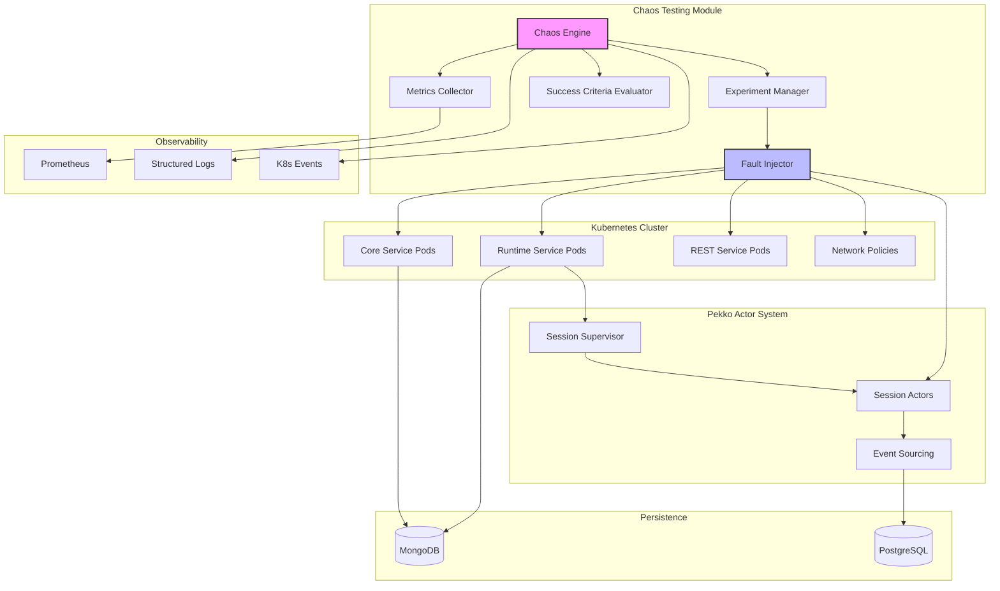

# Design Document: Chaos Engineering Testing

## Overview

This design introduces chaos engineering capabilities to the agent-engine platform, enabling controlled fault injection to validate resilience, error handling, and recovery mechanisms across the distributed Java 25/Quarkus runtime.

The chaos testing system consists of two primary components:

1. **Chaos Engine**: Orchestrates experiment lifecycle (scheduling, execution, monitoring, evaluation)
2. **Fault Injector**: Implements specific fault injection mechanisms (pod kills, network failures, resource stress, message delays)

The system integrates with existing infrastructure:
- **Pekko Actors**: Session management with event sourcing and supervision strategies
- **Kubernetes**: Container orchestration with network policies and pod lifecycle management
- **MongoDB**: Persistence layer for agent configs, sessions, and event journals
- **PostgreSQL**: Event sourcing journal and snapshot storage
- **Observability Stack**: Metrics collection via Prometheus, structured logging, Kubernetes events

### Design Goals

- **Kubernetes-Native**: Leverage native Kubernetes primitives (network policies, pod deletion, resource limits) for fault injection
- **Actor-Aware**: Integrate with Pekko actor supervision and event sourcing for message-level faults
- **Safety-First**: Enforce blast radius controls and emergency stop mechanisms
- **Observable**: Emit structured events, metrics, and logs for correlation with application behavior
- **Declarative**: Define experiments as version-controlled JSON configurations
- **Automated**: Support scheduled execution with success criteria evaluation

## Architecture

### Component Diagram



### Module Structure

The chaos testing feature will be implemented as a new module following the existing architecture:

```
chaos/
├── api/                          # Public API contracts
│   ├── ExperimentDefinition      # Experiment configuration model
│   ├── ExperimentResult          # Execution results and metrics
│   ├── FaultType                 # Enumeration of fault types
│   └── ChaosService              # Service interface
├── core/                         # Implementation
│   ├── engine/
│   │   ├── ChaosEngine           # Orchestration and lifecycle
│   │   ├── ExperimentScheduler   # Cron-based scheduling
│   │   └── ExperimentExecutor    # Execution coordination
│   ├── injection/
│   │   ├── FaultInjector         # Abstract fault injector
│   │   ├── KubernetesFaultInjector
│   │   ├── PekkoFaultInjector
│   │   └── DatabaseFaultInjector
│   ├── metrics/
│   │   ├── MetricsCollector      # Baseline and runtime metrics
│   │   └── SteadyStateAnalyzer   # Deviation detection
│   └── evaluation/
│       └── SuccessCriteriaEvaluator
└── integration/                  # Integration tests
    └── ChaosExperimentIT
```

### Integration Points

1. **Kubernetes API**: Pod lifecycle, network policies, resource quotas
2. **Pekko ActorSystem**: Custom mailbox for message delays/drops, supervision hooks
3. **MongoDB Client**: Connection pool manipulation for database faults
4. **Prometheus**: Metrics scraping for steady state and deviation analysis
5. **Quarkus Health**: Integration with existing health check endpoints

## Components and Interfaces

### Chaos Engine

The Chaos Engine orchestrates the complete experiment lifecycle.

**Responsibilities:**
- Parse and validate experiment definitions
- Schedule experiments based on cron expressions
- Coordinate fault injection and removal
- Collect baseline, during-fault, and post-recovery metrics
- Evaluate success criteria
- Generate experiment reports
- Emit Kubernetes events and structured logs

**Key Methods:**
```java
public interface ChaosEngine {
    CompletionStage<ExperimentResult> executeExperiment(ExperimentDefinition experiment);
    CompletionStage<Void> scheduleExperiment(ExperimentDefinition experiment, String cronExpression);
    CompletionStage<Void> emergencyStop(String experimentId);
    List<ExperimentResult> getExperimentHistory(String targetSelector);
}
```

### Fault Injector

Abstract interface for fault injection implementations.

**Responsibilities:**
- Inject specific fault types into target components
- Respect blast radius constraints
- Remove faults cleanly
- Record fault injection events

**Key Methods:**
```java
public interface FaultInjector {
    CompletionStage<FaultInjectionResult> injectFault(
        FaultType faultType,
        TargetSelector target,
        FaultParameters parameters,
        BlastRadius blastRadius
    );
    
    CompletionStage<Void> removeFault(String faultId);
    
    boolean supports(FaultType faultType);
}
```

### Kubernetes Fault Injector

Implements Kubernetes-native fault injection.

**Fault Types:**
- `POD_KILL`: Delete pods matching selector
- `NETWORK_PARTITION`: Apply network policies to block traffic
- `NETWORK_LATENCY`: Deploy sidecar proxy with tc (traffic control)
- `NETWORK_PACKET_LOSS`: Deploy sidecar proxy with packet drop rules
- `CPU_STRESS`: Deploy stress-ng sidecar with CPU load
- `MEMORY_STRESS`: Deploy stress-ng sidecar with memory allocation
- `DISK_STRESS`: Deploy stress-ng sidecar with I/O operations

**Implementation Strategy:**
- Use Fabric8 Kubernetes Java client for API interactions
- Apply network policies for network partitions
- Use DaemonSet or sidecar injection for resource stress
- Leverage pod labels for blast radius enforcement

### Pekko Fault Injector

Implements actor message-level fault injection.

**Fault Types:**
- `MESSAGE_DELAY`: Delay message delivery by configured duration
- `MESSAGE_DROP`: Drop percentage of messages

**Implementation Strategy:**
- Custom mailbox implementation extending `UnboundedMailbox`
- Intercept `enqueue()` to apply delays or drops
- Use Pekko TestKit patterns for deterministic testing
- Register custom mailbox via Pekko configuration

**Example Custom Mailbox:**
```java
public class ChaoticMailbox extends UnboundedMailbox {
    private final ChaosConfig config;
    
    @Override
    public void enqueue(Envelope envelope) {
        if (config.shouldDropMessage()) {
            // Drop message
            return;
        }
        if (config.shouldDelayMessage()) {
            scheduler.scheduleOnce(
                config.getDelay(),
                () -> super.enqueue(envelope)
            );
        } else {
            super.enqueue(envelope);
        }
    }
}
```

### Database Fault Injector

Implements database connectivity faults.

**Fault Types:**
- `DATABASE_FAILURE`: Block MongoDB connections

**Implementation Strategy:**
- Use Kubernetes network policies to block MongoDB service
- Alternative: Toxiproxy sidecar for more granular control
- Monitor connection pool metrics during fault

### Metrics Collector

Collects steady state and runtime metrics.

**Metrics:**
- Request success rate (from Prometheus)
- Latency percentiles (p50, p95, p99)
- Error rate
- Active sessions (from runtime service)
- Event sourcing lag (from Pekko persistence)
- MongoDB operation latency
- Pod restart count
- CPU/memory utilization

**Implementation:**
```java
public record SteadyStateMetrics(
    double successRate,
    Duration p50Latency,
    Duration p95Latency,
    Duration p99Latency,
    double errorRate,
    int activeSessions,
    Duration eventSourcingLag,
    Duration mongoLatency,
    int podRestarts,
    Instant timestamp
) {}
```

### Success Criteria Evaluator

Evaluates experiment success based on configured criteria.

**Criteria Types:**
- `MAX_ERROR_RATE`: Error rate must not exceed threshold
- `MAX_LATENCY_P99`: P99 latency must not exceed threshold
- `MIN_SUCCESS_RATE`: Success rate must remain above threshold
- `MAX_RECOVERY_TIME`: Recovery time must not exceed threshold
- `ZERO_DATA_LOSS`: No event sequence gaps or replay inconsistencies

**Evaluation Logic:**
```java
public record SuccessCriterion(
    CriterionType type,
    double threshold,
    String description
) {}

public record EvaluationResult(
    boolean passed,
    List<CriterionFailure> failures,
    SteadyStateMetrics baseline,
    SteadyStateMetrics duringFault,
    SteadyStateMetrics postRecovery
) {}
```

## Data Models

### Experiment Definition

```java
public record ExperimentDefinition(
    String name,
    String description,
    TargetSelector target,
    FaultType faultType,
    FaultParameters parameters,
    Duration duration,
    BlastRadius blastRadius,
    List<SuccessCriterion> successCriteria,
    Duration observationWindow,
    Duration recoveryWindow,
    String schedule,  // Optional cron expression
    Map<String, String> labels
) {}
```

### Target Selector

```java
public record TargetSelector(
    String namespace,
    String service,
    Map<String, String> podLabels,
    String actorPath  // For Pekko faults
) {}
```

### Fault Parameters

```java
public record FaultParameters(
    // Network faults
    Duration latency,
    double packetLossPercentage,
    List<String> blockedServices,
    
    // Resource faults
    int cpuPercentage,
    String memoryLimit,
    String diskIORate,
    
    // Message faults
    Duration messageDelay,
    double messageDropPercentage
) {}
```

### Blast Radius

```java
public enum BlastRadiusScope {
    SINGLE_POD,
    SERVICE,
    NAMESPACE,
    CLUSTER,
    UNKNOWN;
    
    public static BlastRadiusScope valueOfOrDefault(String value) {
        try {
            return valueOf(value);
        } catch (IllegalArgumentException e) {
            return UNKNOWN;
        }
    }
}

public record BlastRadius(
    BlastRadiusScope scope,
    int maxPods,
    double maxPercentage  // Max percentage of pods to affect
) {}
```

### Experiment Result

```java
public record ExperimentResult(
    String experimentId,
    String experimentName,
    Instant startTime,
    Instant endTime,
    ExperimentStatus status,
    SteadyStateMetrics baseline,
    List<SteadyStateMetrics> duringFaultMetrics,
    SteadyStateMetrics postRecovery,
    EvaluationResult evaluation,
    List<FaultEvent> faultEvents,
    Duration recoveryTime,
    String abortReason
) {}

public enum ExperimentStatus {
    SCHEDULED,
    RUNNING,
    PASSED,
    FAILED,
    ABORTED,
    UNKNOWN;
    
    public static ExperimentStatus valueOfOrDefault(String value) {
        try {
            return valueOf(value);
        } catch (IllegalArgumentException e) {
            return UNKNOWN;
        }
    }
}
```

### Fault Type Enumeration

```java
public enum FaultType {
    // Kubernetes faults
    POD_KILL,
    NETWORK_PARTITION,
    NETWORK_LATENCY,
    NETWORK_PACKET_LOSS,
    CPU_STRESS,
    MEMORY_STRESS,
    DISK_STRESS,
    
    // Database faults
    DATABASE_FAILURE,
    
    // Actor faults
    MESSAGE_DELAY,
    MESSAGE_DROP,
    
    UNKNOWN;
    
    public static FaultType valueOfOrDefault(String value) {
        try {
            return valueOf(value);
        } catch (IllegalArgumentException e) {
            return UNKNOWN;
        }
    }
}
```

## Error Handling

### Fault Injection Failures

**Scenario**: Fault injection fails (e.g., Kubernetes API error, invalid selector)

**Handling**:
- Abort experiment immediately
- Mark experiment as `ABORTED` with failure reason
- Attempt to clean up any partially applied faults
- Emit alert to configured notification channels
- Log detailed error with stack trace

### Emergency Stop Failures

**Scenario**: Emergency stop cannot remove faults (e.g., network policy deletion fails)

**Handling**:
- Escalate to manual intervention
- Send high-priority alerts (PagerDuty, Slack)
- Log emergency stop failure with remediation steps
- Mark experiment as requiring manual cleanup
- Provide CLI command for manual fault removal

### Metrics Collection Failures

**Scenario**: Prometheus unavailable or metrics incomplete

**Handling**:
- Continue experiment but mark metrics as incomplete
- Use degraded success criteria evaluation (skip metrics-dependent criteria)
- Log warning about incomplete metrics
- Include metrics collection failure in experiment report

### Session Recovery Validation Failures

**Scenario**: Session state inconsistency detected after recovery

**Handling**:
- Mark experiment as `FAILED`
- Record specific inconsistency details (missing events, state mismatch)
- Preserve session state snapshots for debugging
- Emit critical alert for data integrity issue

### Blast Radius Violations

**Scenario**: Experiment would exceed configured blast radius

**Handling**:
- Abort experiment before fault injection
- Log safety violation with target details
- Return validation error to caller
- Require explicit blast radius increase or target refinement

## Testing Strategy

### Unit Testing

Unit tests will focus on:

1. **Experiment Definition Parsing**: Validate JSON parsing and field validation
2. **Success Criteria Evaluation**: Test threshold comparisons and pass/fail logic
3. **Blast Radius Calculation**: Verify pod selection respects percentage limits
4. **Metrics Calculation**: Test recovery time, deviation percentage calculations
5. **Fault Parameter Validation**: Ensure invalid parameters are rejected

Example unit tests:
- `ExperimentDefinitionTest.shouldRejectInvalidFaultType()`
- `SuccessCriteriaEvaluatorTest.shouldFailWhenErrorRateExceedsThreshold()`
- `BlastRadiusEnforcerTest.shouldLimitPodsToConfiguredPercentage()`

### Integration Testing

Integration tests will validate end-to-end experiment execution using Testcontainers:

1. **Pod Kill Recovery**: Kill runtime pod, verify session recovery from event journal
2. **Network Partition Handling**: Block MongoDB, verify graceful degradation
3. **Message Delay Resilience**: Delay actor messages, verify event ordering preserved
4. **Resource Stress Behavior**: Apply CPU stress, verify backpressure mechanisms
5. **Emergency Stop**: Trigger emergency stop mid-experiment, verify clean fault removal

Example integration tests:
- `PodKillExperimentIT.shouldRecoverSessionAfterPodKill()`
- `NetworkPartitionExperimentIT.shouldDegradeGracefullyWhenMongoUnavailable()`
- `MessageDelayExperimentIT.shouldPreserveEventOrderingWithDelays()`

**Test Infrastructure**:
- Kubernetes cluster via Kind (Kubernetes in Docker)
- MongoDB and PostgreSQL via Testcontainers
- Pekko cluster with multiple nodes
- Prometheus for metrics collection

### Property-Based Testing

Property-based testing is **NOT applicable** for this feature because:

1. **Infrastructure Testing**: Chaos testing validates infrastructure behavior (Kubernetes, network, databases), not pure function logic
2. **Side-Effect Heavy**: Experiments involve side effects (pod deletion, network manipulation) that cannot be modeled as pure functions
3. **External Dependencies**: Testing requires real Kubernetes clusters, databases, and actor systems
4. **Non-Deterministic**: Fault injection timing and recovery behavior are inherently non-deterministic

Instead, use:
- **Integration tests** with representative scenarios (1-3 examples per fault type)
- **Smoke tests** for configuration validation and dry-run mode
- **Manual chaos experiments** in staging environments

## Configuration Schema

### Experiment Configuration File

Experiments are defined as JSON files in `configs/chaos/experiments/`:

```json
{
  "name": "runtime-pod-kill-recovery",
  "description": "Validate session recovery after runtime pod termination",
  "target": {
    "namespace": "agent-engine",
    "service": "runtime",
    "podLabels": {
      "app": "runtime"
    }
  },
  "faultType": "POD_KILL",
  "parameters": {},
  "duration": "PT30S",
  "blastRadius": {
    "scope": "SERVICE",
    "maxPods": 1,
    "maxPercentage": 25.0
  },
  "successCriteria": [
    {
      "type": "ZERO_DATA_LOSS",
      "threshold": 0.0,
      "description": "No event sequence gaps after recovery"
    },
    {
      "type": "MAX_RECOVERY_TIME",
      "threshold": 60.0,
      "description": "Recovery within 60 seconds"
    }
  ],
  "observationWindow": "PT60S",
  "recoveryWindow": "PT60S",
  "schedule": "0 */6 * * *",
  "labels": {
    "environment": "staging",
    "team": "platform"
  }
}
```

### Chaos Engine Configuration

Global chaos engine settings in `configs/infra/chaos-configs.json`:

```json
{
  "_id": "chaos_config",
  "category": "chaos",
  "enabled": true,
  "defaultBlastRadius": {
    "scope": "SERVICE",
    "maxPods": 2,
    "maxPercentage": 25.0
  },
  "defaultObservationWindow": "PT60S",
  "defaultRecoveryWindow": "PT60S",
  "metricsCollectionInterval": "PT10S",
  "productionSafetyChecks": {
    "requireApprovalFlag": true,
    "maxBlastRadiusPercentage": 10.0,
    "allowedNamespaces": ["agent-engine-staging"]
  },
  "notifications": {
    "slackWebhook": "${CHAOS_SLACK_WEBHOOK}",
    "emailRecipients": ["platform-team@example.com"]
  },
  "prometheusUrl": "http://prometheus:9090"
}
```

## Safety Mechanisms

### Blast Radius Enforcement

1. **Pre-Flight Validation**: Calculate affected pods before fault injection
2. **Percentage Limits**: Enforce maximum percentage of pods per scope
3. **Production Restrictions**: Stricter limits for production namespaces
4. **Explicit Approval**: Require approval flag for production experiments

### Emergency Stop

1. **API Endpoint**: `POST /chaos/experiments/{id}/stop`
2. **CLI Command**: `kubectl annotate experiment/{id} chaos.agentengine.com/stop=true`
3. **Automatic Triggers**: Stop on critical alerts or health check failures
4. **Timeout**: Automatic stop if experiment exceeds maximum duration

### Dry-Run Mode

1. **Validation Only**: Parse and validate experiment without fault injection
2. **Target Resolution**: Show which pods would be affected
3. **Metrics Preview**: Display baseline metrics without running experiment
4. **CLI Flag**: `--dry-run` flag for experiment execution

### Environment Isolation

1. **Namespace Restrictions**: Configure allowed namespaces per environment
2. **Label Requirements**: Require specific labels for chaos-enabled pods
3. **RBAC**: Separate service accounts with limited permissions
4. **Audit Logging**: Log all experiment executions with user attribution

## Observability Integration

### Kubernetes Events

Emit events for experiment lifecycle:

```yaml
apiVersion: v1
kind: Event
metadata:
  name: chaos-experiment-started
  namespace: agent-engine
reason: ChaosExperimentStarted
message: "Experiment 'runtime-pod-kill-recovery' started targeting service 'runtime'"
involvedObject:
  kind: Pod
  name: runtime-abc123
  namespace: agent-engine
type: Normal
```

### Prometheus Metrics

Expose metrics via `/metrics` endpoint:

```
# Experiment execution metrics
chaos_experiments_total{status="passed|failed|aborted"} 42
chaos_experiments_duration_seconds{experiment="runtime-pod-kill"} 120.5
chaos_experiments_recovery_time_seconds{experiment="runtime-pod-kill"} 45.2

# Fault injection metrics
chaos_faults_injected_total{fault_type="POD_KILL"} 15
chaos_faults_active{fault_type="NETWORK_LATENCY"} 2

# Success criteria metrics
chaos_success_criteria_passed_total{criterion="MAX_ERROR_RATE"} 38
chaos_success_criteria_failed_total{criterion="MAX_RECOVERY_TIME"} 4
```

### Structured Logging

Log experiment events with structured fields:

```json
{
  "timestamp": "2025-01-15T10:30:00Z",
  "level": "INFO",
  "logger": "ChaosEngine",
  "message": "Experiment started",
  "experiment_id": "exp-123",
  "experiment_name": "runtime-pod-kill-recovery",
  "target_service": "runtime",
  "fault_type": "POD_KILL",
  "blast_radius_scope": "SERVICE"
}
```

### Trace Correlation

1. **Trace IDs**: Propagate trace IDs through experiment execution
2. **Span Annotations**: Annotate spans with experiment metadata
3. **Correlation**: Link experiment events to application traces
4. **Dashboards**: Grafana dashboards showing experiments alongside app metrics

## Deployment Considerations

### Module Deployment

The chaos module can be deployed in two modes:

1. **Embedded**: Run within existing runtime/core services (development)
2. **Standalone**: Separate chaos-controller service (production)

### RBAC Requirements

Kubernetes service account needs permissions:

```yaml
apiVersion: rbac.authorization.k8s.io/v1
kind: ClusterRole
metadata:
  name: chaos-controller
rules:
- apiGroups: [""]
  resources: ["pods"]
  verbs: ["get", "list", "delete"]
- apiGroups: [""]
  resources: ["pods/log"]
  verbs: ["get"]
- apiGroups: ["networking.k8s.io"]
  resources: ["networkpolicies"]
  verbs: ["create", "delete", "get", "list"]
- apiGroups: [""]
  resources: ["events"]
  verbs: ["create", "patch"]
```

### Resource Requirements

Chaos controller resource allocation:

```yaml
resources:
  requests:
    memory: "256Mi"
    cpu: "100m"
  limits:
    memory: "512Mi"
    cpu: "500m"
```

### Configuration Management

1. **Environment-Specific**: Separate experiment configs per environment
2. **Version Control**: Store experiments in Git alongside infrastructure code
3. **Validation**: CI pipeline validates experiment definitions
4. **Approval**: Production experiments require PR approval

## Future Enhancements

1. **Advanced Fault Types**: JVM heap exhaustion, GC pauses, thread pool saturation
2. **Multi-Region**: Cross-region network latency and partition testing
3. **Chaos Mesh Integration**: Leverage Chaos Mesh for richer fault injection
4. **ML-Based Analysis**: Anomaly detection for unexpected behavior patterns
5. **Automated Remediation**: Trigger automated fixes based on experiment results
6. **Game Days**: Coordinated multi-experiment scenarios
7. **Blast Radius Visualization**: Real-time visualization of affected components
