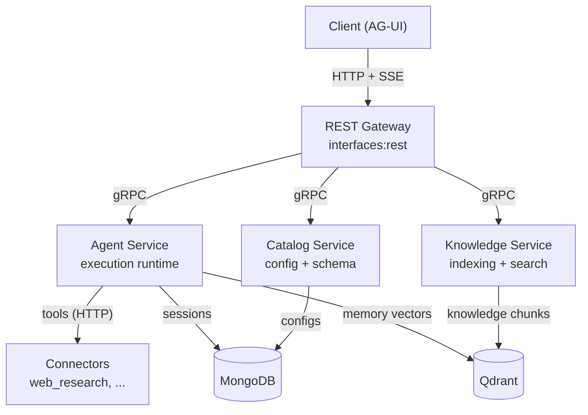

<div align="center">

# Agent Engine

**A declarative, config-driven runtime for building and orchestrating production-grade LLM agents on the JVM.**

[](#)
[](#)
[](#)
[](#)
[](#)
[](LICENSE)

</div>

---

## Table of Contents

- [Why Agent Engine](#why-agent-engine)
- [Key Features](#key-features)
- [Architecture](#architecture)
- [Quick Start](#quick-start)
- [Building and Testing](#building-and-testing)
- [REST API](#rest-api)
- [Tools](#tools)
- [Configuration](#configuration)
- [Documentation](#documentation)
- [License](#license)

---

## Why Agent Engine

Most agent frameworks hand you a single LLM loop with a few tools. Taking that to production is where the real work begins — orchestrating multiple agents, managing context windows, enforcing guardrails, persisting sessions, giving agents long-term memory, indexing documents for retrieval, and running all of it as scalable services.

**Agent Engine treats that production surface as declarative configuration backed by production-grade infrastructure.** Agents, models, tools, context strategies, guardrails, and orchestration are defined as JSON/YAML and resolved at runtime — so new behavior is added by writing config and providers, not by editing the engine. Underneath, it ships the infrastructure those agents actually need in production:

- **Persistent sessions and cross-session memory** so agents remember across runs
- **Document knowledge indexing and semantic search** for retrieval-augmented agents
- **Multi-stage guardrails** for input, tool, and output safety
- **A gRPC-based microservice runtime** that deploys to Kubernetes out of the box

The result is a runtime where the interesting work lives in configuration and small plugins, while the hard distributed-systems concerns are handled once, consistently, by the engine.

> [!NOTE]
> This project is in active development. Backward compatibility is not guaranteed and core APIs may change.

---

## Key Features

- **Declarative agents** — agents, models, tools, context, and guardrails are flat JSON/YAML configs resolved and validated at runtime.
- **Multi-agent orchestration** — `TRANSFER`, `SEQUENTIAL`, and `PARALLEL` modes, with configurable stopping and aggregation policies and deterministic fallback for parallel fan-out.
- **Context management** — pluggable `compaction`, `last_n`, and `none` strategies applied transparently before each model call.
- **Multi-stage guardrails** — `INPUT`, `TOOL`, and `OUTPUT` stages with `allow / warn / block / escalate` semantics and configurable fail-open or fail-closed behavior.
- **Pluggable tools** — tools and toolsets discovered via CDI and annotations, globally visible to every agent, with parallel or sequential execution per turn.
- **Persistent memory and knowledge** — cross-session per-user memory and document semantic search, both backed by Qdrant.
- **Stateful sessions** — pause/resume for human-in-the-loop and confirmation flows, plus run-level rollback.
- **Streaming API** — REST gateway emitting AG-UI server-sent events.
- **Distributed by design** — internal gRPC microservice transport with local-bean-first dispatch and dynamic proxy fallback.
- **Multi-provider models** — LangChain4j adapters for Ollama, OpenAI-compatible, and Gemini backends.

---

## Architecture

Agent Engine runs as four cooperating services that communicate over an internal gRPC transport and share MongoDB and Qdrant for state. Execution is built on **Google ADK** for agent and session primitives.



### Services

| Service | Module | Responsibility |
|---|---|---|
| **Agent** | `agent` | Execution runtime: agent construction, model providers, tools, guardrails, orchestration, sessions, memory |
| **Catalog** | `catalog` | Config CRUD and validation, asset catalog, schema contracts, AG-UI event mapping |
| **Knowledge** | `knowledge` | Text-file indexing and semantic search over Qdrant |
| **REST** | `interfaces:rest` | User-facing HTTP/SSE gateway (port 8080) |

### Supporting modules

- **`connectors:core`** — a config-driven HTTP connector framework (templating, auth, pagination, retry) used by tools such as `web_research`.
- **`agent:api`, `catalog:api`, `knowledge:api`** — service contracts and shared models that decouple transport from implementation.
- **`util:*`** — shared utilities: `common`, `mongodb`, `vectordb`, `cloudstorage`, `ms` (microservice transport), `agents`, `pekko`.

### Request flow

1. REST receives an AG-UI `RunAgentInput` at `POST /v1/agent/{agentId}/invoke`.
2. The request is dispatched to the Agent service via a local bean or gRPC proxy.
3. The runtime resolves the agent config and session, then builds the agent graph, model, and toolsets.
4. The Google ADK runner emits a stream of events.
5. Events are mapped to AG-UI SSE and streamed back to the caller.
6. Session state and history persist via the Mongo-backed session repository.

### Data stores

- **MongoDB** — agent/model configs, sessions with serialized event history, and infra defaults.
- **Qdrant** — persistent per-user memory and indexed knowledge chunks for semantic retrieval.

---

## Quick Start

> **Prerequisites:** Java 25, Docker, and a Kubernetes context (the deploy scripts provision MongoDB and Qdrant for you).

Agent Engine deploys through Kubernetes-native Helm charts under [`k8s/`](k8s).

```bash
# Deploy the standard stack: builds service images and applies the
# agent, catalog, knowledge, and rest charts.
./k8s/scripts/deploy.sh

# Sync infra, model, and agent configs when needed.
./k8s/scripts/seed-configs.sh

# Tear it down.
./k8s/scripts/cleanup.sh
```

Build service images manually with the shared Dockerfile when you need a custom workflow:

```bash
docker build --build-arg SERVICE_MODULE=agent           -f docker/Dockerfile .
docker build --build-arg SERVICE_MODULE=catalog         -f docker/Dockerfile .
docker build --build-arg SERVICE_MODULE=knowledge       -f docker/Dockerfile .
docker build --build-arg SERVICE_MODULE=interfaces/rest -f docker/Dockerfile .
```

---

## Building and Testing

```bash
# Compile and build uber-jars (skip tests for speed)
./gradlew clean build -x test

# Unit tests
./gradlew test

# Integration tests (opt-in; requires Docker for Testcontainers)
./gradlew integrationTest
```

**Conventions** — unit tests live in `src/test/java` (`<ClassName>Test`, `should<Behavior>When<Condition>`); integration tests live in `src/integrationTest/java` (`<Feature>IT`) and use `@QuarkusTest` with container-backed resources where runtime wiring matters. Use mocks for pure logic; use real containers when validating persistence, transport, or end-to-end wiring. Coverage reports are generated per module, e.g. `agent/build/reports/jacoco/test/html/index.html`.

---

## REST API

Interact with agents through the REST gateway. The invoke endpoint streams AG-UI SSE events:

```http
POST /v1/agent/{agentId}/invoke
Content-Type: application/json
Accept: text/event-stream
```

```json
{
  "threadId": "optional-session-uuid",
  "runId":    "client-run-uuid",
  "messages": [
    { "id": "msg-1", "role": "user", "content": "Hello!" }
  ]
}
```

`threadId` maps to the session ID; omit it to start a new session. Other primary path groups are `/v1/model`, `/v1/catalog`, and `/schemas`. Sessions support resume (`/v1/agent/session/{id}/resume/events`) and rollback (`/v1/agent/session/{id}/rollback?runId=...`).

See [`docs/04-rest-and-grpc-apis.md`](docs/04-rest-and-grpc-apis.md) for the full endpoint and gRPC reference.

---

## Tools

Tools are provided through `ToolProvider` / `ToolsetProvider` CDI beans plus auto-discovered tools annotated with `@DiscoverableTool`. A tool exposes an `execute(...)` method and returns a `ToolDescriptor` carrying its name, risk level, and config schema. All registered tools are globally visible to every agent; selecting a toolset activates its members at runtime without flattening them.

| Suite / group | Tools |
|---|---|
| `planning` | `create_plan`, `update_plan`, `add_task`, `update_task_info`, `start_task`, `complete_task`, `finish_plan`, `view_plan` |
| `agent_tools` | `spawn_agent`, `send_message`, `await_agent`, `lookup_expert` |
| `file_tools` | `read_file`, `list_dir`, `grep_files`, `apply_patch` |
| Shell | `run_cmd` (sandboxed; `rm` blocked, output-capped, `HIGH` risk) |
| Web | `web_research` (DuckDuckGo quick lookup or Brave detailed search via the connectors framework) |
| Knowledge | `search_knowledge` (semantic search over indexed chunks) |
| Utility | `echo` |
| Internal | `request_human_input` (auto-injected for pause/resume flows) |

By default, tools requested in a single turn execute in parallel; set `toolExecutionMode: "SEQUENTIAL"` on the agent config for dependent side effects. See [`docs/05-tooling-and-plugins.md`](docs/05-tooling-and-plugins.md) for the extension model.

---

## Configuration

Agents and models are declared as JSON/YAML under [`configs/`](configs) and bootstrapped into MongoDB on startup. Agent config is flattened — `modelId`, `systemPrompt`, `tools`, `contextStrategy`, `guardrails`, and orchestration fields are first-class. Pre-configured agents (coding, review, shell, web research, and a sequential orchestrator) ship under `configs/agents/`.

### Core runtime settings

- `mongodb.connection.string` / `MONGODB_CONNECTION_STRING` — config and session store (default `mongodb://localhost:27018`)
- `agentengine.grpc.host` / `agentengine.grpc.port` — REST-to-service gRPC transport

In Kubernetes, non-secret runtime config is mounted as `application.properties`; sensitive values come from Secret-backed environment variables.

> **Local llama.cpp note:** some `.gguf` models (e.g. `qwen3-coder-30b`) ship chat templates that 500 on complex nested JSON schemas. Override with `--chat-template-file` pointing to the safe template in `configs/models/templates/`.

See [`docs/03-configuration-reference.md`](docs/03-configuration-reference.md) for the complete field, enum, and validation reference.

---

## Documentation

In-depth documentation lives under [`docs/`](docs):

| Doc | Topic |
|---|---|
| [`01-system-overview.md`](docs/01-system-overview.md) | Modules, execution model, data domains |
| [`02-runtime-architecture.md`](docs/02-runtime-architecture.md) | Services, lifecycle, orchestration, memory, rollback |
| [`03-configuration-reference.md`](docs/03-configuration-reference.md) | Agent, model, guardrail, and knowledge config |
| [`04-rest-and-grpc-apis.md`](docs/04-rest-and-grpc-apis.md) | REST endpoints and gRPC transport |
| [`05-tooling-and-plugins.md`](docs/05-tooling-and-plugins.md) | Tool contract and extension points |
| [`06-connectors-framework.md`](docs/06-connectors-framework.md) | Config-driven HTTP connector engine |
| [`community-model.md`](docs/community-model.md) | Expert discovery and invocation |

---

## License

Copyright 2025 Rahul Patel.

Agent Engine is source-available under the [PolyForm Noncommercial License 1.0.0](LICENSE). You are free to read, study, modify, and use it for any **noncommercial** purpose. **Commercial use is not granted** under this license — for commercial licensing, contact the author.
